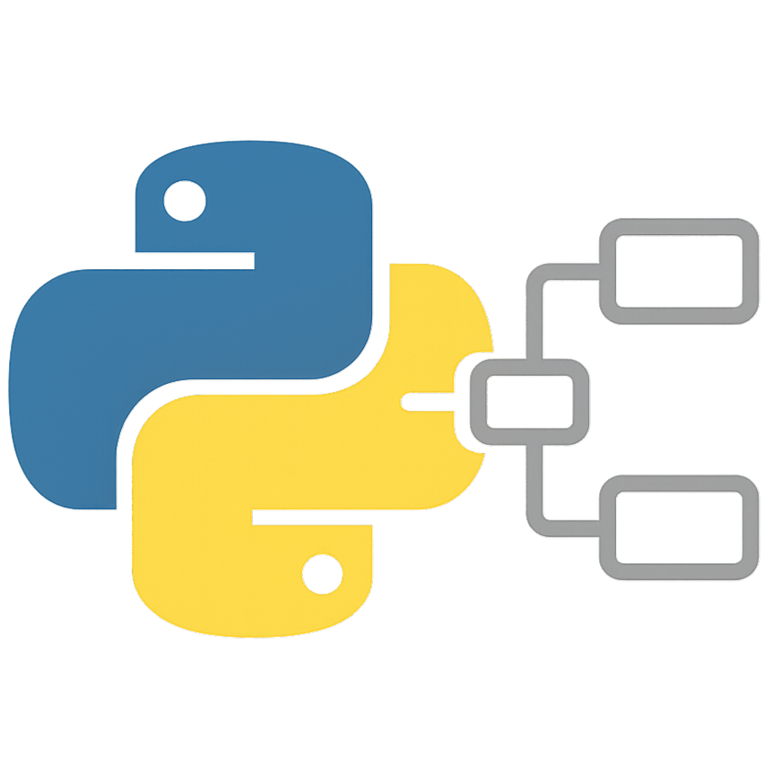

#  PyNode - Visual Workflow System

A Node-RED-like visual workflow editor with a Python backend. Create workflows by connecting Python nodes that process and route messages.


https://github.com/user-attachments/assets/0b53085a-2cc6-4c26-bd43-e0de1e0716a2


## Features

- **Visual Node Editor**: Drag-and-drop interface for creating workflows
- **Python Backend**: All nodes are Python classes that can be easily extended
- **Fully Extensible**: Third-party nodes can be added without modifying core code
- **UI Components**: Nodes can define interactive controls (buttons, toggles, displays) in their cards
- **Node-RED Compatible Messages**: Message structure with `payload` and `topic` fields
- **Built-in Nodes**:
  - **InjectNode**: Generate messages with configurable payloads
  - **FunctionNode**: Execute custom Python code on messages
  - **DebugNode**: Display messages in the debug panel
  - **ChangeNode**: Modify message properties
  - **SwitchNode**: Route messages based on conditions
  - **DelayNode**: Delay message delivery
  - **GateNode**: Control message flow with real-time toggle
  - **RateProbeNode**: Monitor message throughput
  - **Vision Nodes**: Camera input, YOLO detection, image processing
- **REST API**: Complete API for programmatic workflow management
- **Export/Import**: Save and load workflows as JSON
- **Dynamic Properties**: Node properties and UI components defined in node classes

## Quick Start

### Clone the Repository

```bash
git clone https://github.com/olkham/pynode.git
cd pynode
```

### Option 1: Automated Setup (Recommended)

The setup scripts will create a virtual environment, detect CUDA if available, install PyTorch with appropriate GPU support, and install all dependencies.

**Windows**:
```bash
# Use Python from PATH
setup.bat

# Or specify Python path
setup.bat "C:\Python312\python.exe"
```

**Linux/Mac**:
```bash
chmod +x setup.sh
./setup.sh
```

The scripts will:
- Create a virtual environment in `appenv/`
- Detect CUDA version and install matching PyTorch build
- Install CPU-only PyTorch if CUDA is not detected
- Install all required dependencies
- Optionally install node-specific dependencies

**Activate the environment**:
- Windows: `appenv\Scripts\activate.bat`
- Linux/Mac: `source appenv/bin/activate`

### Option 2: Manual Installation

If you prefer manual installation or have specific requirements:

```bash
pip install -e .
```

### Run the Server

```bash
pynode
# or
python -m pynode
```

### Open Your Browser

Navigate to `http://localhost:5000`

## Docker Setup

PyNode can be run in a Docker container with GPU support (CUDA 12.6).

### Running with Docker Compose

For mDNS service discovery to work correctly inside Docker, you need to set the `HOST_IP` environment variable to your host machine's IP address:

```bash
# Set the host IP address
export HOST_IP=$(hostname -I | awk '{print $1}')

# Start the container
docker compose up -d
```

The container will:
- Use NVIDIA CUDA 12.6 runtime (requires nvidia-docker)
- Install PyTorch with CUDA 12.6 support
- Install all dependencies including node-specific packages
- Expose port 5000 for web interface
- Support mDNS broadcasting with the correct host IP

**Why set HOST_IP?**
When using the mDNS Broadcast Node inside Docker, it needs to advertise the host machine's IP address (not the container's internal IP like 172.x.x.x) so other devices on your network can discover and connect to the service.

**Access the application:**
- Web UI: `http://localhost:5000`
- From other devices: `http://<your-host-ip>:5000`

**GPU Access:**
The Docker setup requires [NVIDIA Container Toolkit](https://docs.nvidia.com/datacenter/cloud-native/container-toolkit/install-guide.html) to be installed on the host system.

For more details, see [DOCKER.md](DOCKER.md).

## Extending PyNode

PyNode is designed to be easily extended with custom nodes:

- **[Creating Custom Nodes](docs/CUSTOM_NODES.md)** - Complete guide to creating your own nodes
- **[UI Components Guide](docs/UI_COMPONENTS.md)** - Add interactive controls to your nodes
- **[Extensibility Overview](docs/EXTENSIBILITY.md)** - Architecture and design principles

## Project Structure

```
pynode/                     # Project root
├── pynode/                 # Main package
│   ├── __init__.py
│   ├── __main__.py         # Entry point for 'python -m pynode'
│   ├── _version.py         # Version information
│   ├── main.py             # CLI application
│   ├── server.py           # Flask REST API with SSE support
│   ├── workflow_engine.py  # Workflow management
│   ├── models/             # ML model storage
│   ├── nodes/              # Node implementations (each in its own folder)
│   │   ├── __init__.py
│   │   ├── base_node.py    # BaseNode class
│   │   ├── InjectNode/     # Generate messages
│   │   ├── FunctionNode/   # Custom Python code
│   │   ├── DebugNode/      # Debug output
│   │   ├── ChangeNode/     # Modify messages
│   │   ├── SwitchNode/     # Route based on conditions
│   │   ├── DelayNode/      # Delay messages
│   │   ├── GateNode/       # Control message flow
│   │   ├── RateProbeNode/  # Monitor throughput
│   │   ├── QueueLengthProbeNode/  # Monitor queue lengths
│   │   ├── CounterNode/    # Count messages
│   │   ├── CameraNode/     # Camera input
│   │   ├── UltralyticsNode/ # YOLO detection
│   │   ├── ImageViewerNode/ # Display images
│   │   ├── ImageWriterNode/ # Save images
│   │   ├── TrackerNode/    # Object tracking
│   │   ├── MQTTNode/       # MQTT communication
│   │   ├── MessageWriterNode/ # Save message data
│   │   ├── VideoWriterNode/   # Save video
│   │   ├── OpenCV/         # OpenCV operations
│   │   └── ...             # 30+ other node types
│   └── static/             # Web UI
│       ├── index.html
│       ├── style.css
│       ├── js/             # JavaScript modules
│       │   ├── nodes.js
│       │   ├── events.js
│       │   ├── connections.js
│       │   ├── debug.js
│       │   └── ...
│       └── images/         # UI assets
├── examples/               # Example workflows and tutorials
│   ├── camera_workflow.py
│   ├── camera_yolo_workflow.py
│   └── README.md
├── readmes/                # Extended documentation
├── models/                 # ML models (YOLO, etc.)
├── docs/                   # Documentation files
│   ├── CUSTOM_NODES.md     # Guide to creating custom nodes
│   ├── UI_COMPONENTS.md    # Guide to node UI components
│   └── EXTENSIBILITY.md    # Extensibility overview
├── _backup/                # Workflow backups
├── setup.py                # Package installation
├── setup.bat / setup.sh    # Setup scripts
├── requirements.txt        # Core dependencies
├── pyproject.toml          # Build configuration
├── INSTALL.md              # Installation guide
├── DOCKER.md               # Docker setup
├── docker-compose.yml      # Docker compose config
├── Dockerfile              # Docker build (CUDA)
├── Dockerfile.cpu          # Docker build (CPU only)
├── README.md
└── workflow.json           # Current workflow
```

## Creating Custom Nodes

PyNode is fully extensible! All node information (visual properties, property schemas, behavior) is contained within the node class itself. The main application has no hardcoded knowledge of specific node types.

For a complete guide, see [docs/CUSTOM_NODES.md](docs/CUSTOM_NODES.md)

Here's a simple example:

```python
from base_node import BaseNode

class MyCustomNode(BaseNode):
    """Example custom node."""
    
    # Visual properties
    category = 'custom'
    color = '#FFA07A'
    border_color = '#FF7F50'
    text_color = '#000000'
    
    # Property schema (appears in UI)
    properties = [
        {
            'name': 'multiplier',
            'label': 'Multiplier',
            'type': 'text'
        }
    ]
    
    def __init__(self, node_id=None, name="custom"):
        super().__init__(node_id, name)
        self.configure({
            'multiplier': 2
        })
    
    def on_input(self, msg, input_index=0):
        # Process the incoming message
        payload = msg[MessageKeys.PAYLOAD]
        multiplier = float(self.config.get('multiplier', 2))
        
        # Modify the payload
        new_payload = payload * multiplier
        
        # Create and send new message
        new_msg = self.create_message(
            payload=new_payload,
            topic=msg.get('topic', '')
        )
        self.send(new_msg)

# Register your node in app.py
from nodes import MyCustomNode
engine.register_node_type(MyCustomNode)
```

## Message Structure

Messages follow the Node-RED format:

```python
{
    'payload': 'any data type',  # The main message content
    'topic': 'string',            # Optional topic/category
    '_msgid': 'unique-id',        # Auto-generated message ID
    # ... any additional properties
}
```

## API Endpoints

### Nodes
- `GET /api/nodes` - List all nodes
- `POST /api/nodes` - Create a node
- `GET /api/nodes/<id>` - Get node details
- `PUT /api/nodes/<id>` - Update node
- `DELETE /api/nodes/<id>` - Delete node
- `POST /api/nodes/<id>/<action>` - Trigger node action (e.g., inject, start_broadcast, etc.)

### Connections
- `POST /api/connections` - Create connection
- `DELETE /api/connections` - Delete connection

### Workflow
- `GET /api/workflow` - Export workflow
- `POST /api/workflow` - Import workflow
- `POST /api/workflow/start` - Start workflow
- `POST /api/workflow/stop` - Stop workflow
- `GET /api/workflow/stats` - Get statistics

### Debug
- `GET /api/nodes/<id>/debug` - Get debug messages
- `DELETE /api/nodes/<id>/debug` - Clear debug messages

## Example Programmatic Usage

```python
from pynode.workflow_engine import WorkflowEngine
from pynode.nodes import InjectNode, FunctionNode, DebugNode

# Create and configure engine
engine = WorkflowEngine()
engine.register_node_type(InjectNode)
engine.register_node_type(FunctionNode)
engine.register_node_type(DebugNode)

# Create nodes
inject = engine.create_node('InjectNode', name='source')
inject.configure({'payload': 10, 'payloadType': 'num'})

func = engine.create_node('FunctionNode', name='multiply')
func.configure({'func': 'msg["payload"] = msg["payload"] * 2\nreturn msg'})

debug = engine.create_node('DebugNode', name='output')

# Connect nodes: inject -> function -> debug
engine.connect_nodes(inject.id, func.id)
engine.connect_nodes(func.id, debug.id)

# Start and trigger
engine.start()
engine.trigger_inject_node(inject.id)

# Check debug output
messages = engine.get_debug_messages(debug.id)
print(messages)  # Should show payload=20
```

## Web UI Usage

1. **Add Nodes**: Drag nodes from the palette onto the canvas
2. **Connect Nodes**: Click on an output port (right side) and drag to an input port (left side)
3. **Configure Nodes**: Click a node to show its properties panel
4. **Test Workflow**: 
   - Click "Start" to activate the workflow
   - Use "Inject" button on inject nodes to send messages
   - View output in the debug panel at the bottom
5. **Save/Load**: Use Export/Import buttons to save workflows

## Extending the System

### Adding New Node Types

1. Create a new Python class in `pynode/nodes/`
2. Inherit from `BaseNode`
3. Override `on_input()` for message processing
4. Define `properties` for UI configuration
5. Create `requirements.txt` in the node's directory if needed
6. Reload the server to automatically detect new nodes

### Custom Message Processing

Nodes can:
- Modify message payload
- Add/remove message properties
- Send to multiple outputs
- Send multiple messages
- Filter messages
- Store state between messages

### Advanced Features

- **Background Processing**: Use threading for long-running operations
- **External APIs**: Make HTTP requests from function nodes
- **Database Integration**: Store/retrieve data from databases
- **File I/O**: Read/write files in custom nodes
- **Scheduling**: Implement timed node execution

## Development TODOs

### TODOs for Launch
- [ ] Remove some nodes from standard set
- [ ] Create a new repo for extra nodes
- [ ] Model repository management

### Ongoing TODOs
- [ ] Centralize more strings / constants

### Testing
- [ ] Test all nodes

### General TODOs
- [ ] Add multiple workspaces / canvases

### New Nodes
- [ ] OCR (PaddlePaddle) Node
- [ ] Qwen VLM Node
- [ ] SAM3 Node
- [ ] REST Endpoint Node
- [ ] Webhook Node
- [ ] UDP/TCP Node

### Example Flow Documentation Needed
- [ ] Bird Seed level monitor
- [ ] Capture data send to Roboflow / Geti
- [ ] Track objects time in zone
- [ ] Live VLMs
- [ ] ANPR (Detect, Crop, OCR, MQTT)

### Node-Specific TODOs
- [ ] YOLO: Add custom model support
- [ ] YOLO: Add custom target HW string
- [ ] Roboflow: rfdetr
- [ ] Roboflow: upload images
- [ ] DeepSort: Add option to use different feature extractor model

## License

MIT License - Feel free to use and modify!

## Contributing

Contributions welcome! Add new node types, improve the UI, or enhance the engine.
