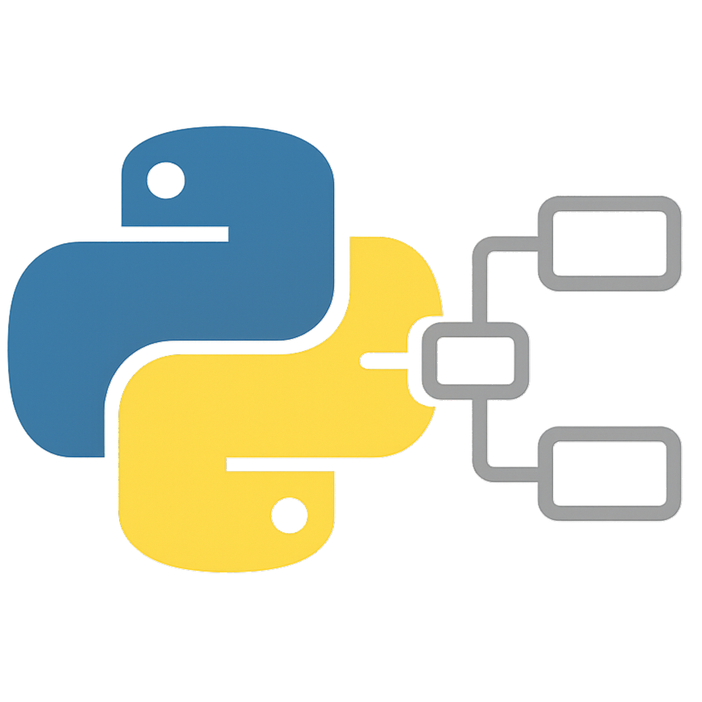

#  PyNode - Visual Workflow System

A Node-RED-like visual workflow editor with a Python backend. Create workflows by connecting Python nodes that process and route messages.

https://github.com/user-attachments/assets/0b53085a-2cc6-4c26-bd43-e0de1e0716a2

## Features

- **Visual Node Editor**: Drag-and-drop interface for creating workflows
- **Python Backend**: All nodes are Python classes that can be easily extended
- **Fully Extensible**: Third-party nodes can be added without modifying core code
- **UI Components**: Nodes can define interactive controls (buttons, toggles, displays) in their cards
- **Node-RED Compatible Messages**: Message structure with `payload` and `topic` fields
- **Multiple Workspaces**: Several independent flows, each with its own deploy/run state
- **REST API**: Complete API for programmatic workflow management
- **Export/Import**: Save and load workflows as JSON
- **Dynamic Properties**: Node properties and UI components defined in node classes

### Built-in Nodes

Around 85 node types ship with PyNode, grouped by palette category. Every node
carries its own documentation in the editor's **Information** panel (ℹ️ tab).

| Category | Nodes |
| --- | --- |
| **Common** | Inject, Debug, Link In / Link Out (named channels between flows) |
| **Function** | Function (custom Python), Change, Filter, Delay, Batch, Join, Split, Range, Slider |
| **Input** | Camera, Frame Source, Video Reader, Image Upload, Message Reader, Omron Camera |
| **Output** | Image Viewer, Image Writer, Video Writer, Message Writer, Roboflow Upload |
| **Logic** | Switch (route on conditions), Gate, Sync, Auto Sync |
| **Network** | MQTT In / Out, UDP In / Out, TCP In / Out, REST Endpoint, Webhook, mDNS Broadcast / Discovery |
| **Vision** | YOLO, Inference, Crop, Slice Image / Slice Collector, Draw Predictions, Confidence Filter, Label Filter, Merge Predictions, Image Format, Qwen3-VL, vLLM |
| **Supervision** | SV Tracker (ByteTrack), SV Annotate (15 visual styles: boxes, labels, traces, heat maps, privacy blur/pixelate), SV Line Counter (in/out crossing counts + events), SV Polygon Zone (occupancy, enter/exit events) — zone geometry drawn directly on a live frame — SV Smoother (de-jitter boxes), SV Detection Filter (confidence/class/area/aspect/top-K + NMS/NMM), SV Sink (CSV/JSON detection logging) |
| **Analysis** | BBox Metrics, Polygon Metrics, Point in Shape |
| **OpenCV** | ~28 image-processing nodes: Blur, Threshold, Morphology, Edge Detector, Find Contours, Perspective, Resize, Rotate, Colormap, Histogram, FFT, Template Match, RealSense Depth, and more |
| **Node Probes** | Rate Probe, Queue Length Probe, Counter |

Highlights:

- **Slider** — an interactive on-card slider that stamps a live value onto any
  `msg` path; drag it and downstream nodes update immediately.
- **UDP In / Out, TCP In / Out** — move messages (including video frames)
  between PyNode instances or to anything else that speaks the wire format.
  Their Information panel contains a ready-made **Node-RED flow you can copy
  and import**, pre-set to the node's port.
- **Video Reader** — video-file playback with on-card transport controls.
- **Inference** — a multi-backend inference node (ONNX Runtime, Ultralytics)
  that discovers available engines at startup.

## Quick Start

### Install from PyPI (recommended for users)

PyNode is published on PyPI as **`pynode-flow`** (the import package stays `pynode`):

```bash
# Core install
pip install pynode-flow

# ...or everything PyPI-installable (all optional nodes)
pip install "pynode-flow[full]"

# Run it
pynode
```

or specify a port:

```bash
pynode --port 8080
```

See [INSTALL.md](INSTALL.md) for the full list of extras (`vision`, `mqtt`,
`camera`, `inference`, `vlm`, `upload`, `discovery`, `full`) and how to install
per-node dependencies with `pynode-install-nodes`.

### Install from source (for development)

Clone the repository:

```bash
git clone https://github.com/olkham/pynode.git
cd pynode
```

### Option 1: Automated Setup (Recommended)

The setup scripts will create a virtual environment, detect CUDA if available, install PyTorch with appropriate GPU support, and install all dependencies.

**Windows**:
```bash
# Use Python from PATH
setup.bat

# Or specify Python path
setup.bat "C:\Python312\python.exe"
```

**Linux/Mac**:
```bash
chmod +x setup.sh
./setup.sh
```

The scripts will:
- Create a virtual environment in `appenv/`
- Detect CUDA version and install matching PyTorch build
- Install CPU-only PyTorch if CUDA is not detected
- Install all required dependencies
- Optionally install node-specific dependencies

**Activate the environment**:
- Windows: `appenv\Scripts\activate.bat`
- Linux/Mac: `source appenv/bin/activate`

### Option 2: Manual Installation

If you prefer manual installation or have specific requirements:

```bash
# Core install (extras optional — see INSTALL.md)
pip install -e .

# With optional extras: specific node groups...
pip install -e ".[vision,mqtt]"

# ...or everything PyPI-installable
pip install -e ".[full]"
```

> `pip install` only pulls the dependencies and extras declared in
> `pyproject.toml`; it does not run each node's `requirements.txt`. The `[full]`
> extra covers every PyPI-installable node. For the few nodes that need a vendor
> SDK (e.g. Omron's `stapipy`), run `pynode-install-nodes` after installing.

### Run the Server

```bash
pynode
# or
python -m pynode
```

### Open Your Browser

Navigate to `http://localhost:5000`

### Load an Example Workflow

Twelve ready-made learning workflows ship with PyNode — from a two-node hello
world up to a camera → YOLO → filter → MQTT alert pipeline (including a "blur
every detected person" privacy flow, a UDP socket bridge and a slider-driven
crop). Load any of them straight from the editor: **☰ menu → Examples → pick
one**, then press **Deploy**. See
[pynode/static/examples/README.md](pynode/static/examples/README.md) for the
guided tour and per-example prerequisites.

### Data Directory

PyNode persists workflows under `<data dir>/workflows/` (`workflow.json` plus timestamped backups in `_backups/`). The data directory is resolved in this order:

1. `pynode --data-dir <path>` CLI flag,
2. `PYNODE_DATA_DIR` environment variable,
3. the source checkout root when running from a git clone / editable install (i.e. `pyproject.toml` sits next to the `pynode` package — this keeps the familiar `workflows/` folder in the repo),
4. `~/.pynode` otherwise (e.g. a regular `pip install`).

The resolved location is logged at startup (`Workflow data directory: ...`).

### Models Directory

Nodes that download or generate model weights (e.g. the YOLO node's `.pt`
files and exported OpenVINO models) write them into a shared **models
directory** instead of the process working directory. It is resolved in this
order:

1. `pynode --models-dir <path>` CLI flag,
2. `PYNODE_MODELS_DIR` environment variable,
3. `<data dir>/models` otherwise — so `<repo>/models` for a source checkout and
   `~/.pynode/models` for a regular `pip install`.

> **Upgrading:** older PyNode versions downloaded model files into whatever the
> working directory happened to be, so stray `.pt` files and
> `*_openvino_model/` folders may exist in the repo root, `pynode/models/` or
> `pynode/nodes/`. PyNode still reads models from those legacy locations, but
> nothing is migrated automatically — you can move them into the models
> directory manually when convenient.

## Securing PyNode

**PyNode executes arbitrary Python by design** (e.g. FunctionNode runs whatever code is in the workflow), so anyone who can reach the API can run code on the host. Authentication is the trust boundary — secure the server before exposing it beyond your own machine:

- **API key**: start with `pynode --api-key <secret>` (or set the `PYNODE_API_KEY` env var). All `/api/` requests then require the key via the `X-API-Key` header or an `api_key` query parameter; the web UI prompts for it on first load and remembers it in the browser. Unset/empty = no authentication (the default).
- **CORS**: restrict allowed browser origins with `pynode --cors-origins http://localhost:5000,https://myhost` (or the `PYNODE_CORS_ORIGINS` env var). Default is `*` (all origins).
- **Bind locally**: when you don't need network access, run `pynode --host 127.0.0.1` so the server is only reachable from the local machine.

## Docker Setup

PyNode can be run in a Docker container with GPU support (CUDA 12.6).

### Running with Docker Compose

For mDNS service discovery to work correctly inside Docker, set the `HOST_IP` environment variable to your host machine's IP address.

```bash
# Set the host IP address
export HOST_IP=$(hostname -I | awk '{print $1}')

# Start the container
docker compose up -d
```

The container will:
- Use NVIDIA CUDA 12.6 runtime (requires nvidia-docker)
- Install PyTorch with CUDA 12.6 support
- Install all dependencies including node-specific packages
- Expose port 5000 for web interface
- Support mDNS broadcasting with the correct host IP

**Why set HOST_IP?**  
When using the mDNS Broadcast Node inside Docker, it needs to advertise the host machine's IP address rather than the container's internal IP so other devices on your network can discover and connect to the service.

**Access the application:**
- Web UI: `http://localhost:5000`
- From other devices: `http://<your-host-ip>:5000`

**GPU Access:**  
The Docker setup requires [NVIDIA Container Toolkit](https://docs.nvidia.com/datacenter/cloud-native/container-toolkit/install-guide.html) to be installed on the host system.

For more details, see [DOCKER.md](DOCKER.md).

## Extending PyNode

PyNode is designed to be easily extended with custom nodes:

- **[Creating Custom Nodes](docs/CUSTOM_NODES.md)** - Complete guide to creating your own nodes
- **[UI Components Guide](docs/UI_COMPONENTS.md)** - Add interactive controls to your nodes
- **[Extensibility Overview](docs/EXTENSIBILITY.md)** - Architecture and design principles

## Project Structure

```text
pynode/                     # Project root
├── pynode/                 # Main package
│   ├── __main__.py         # Entry point for 'python -m pynode'
│   ├── _version.py         # Version (generated by setuptools_scm at build)
│   ├── main.py             # CLI application
│   ├── config.py           # Data/models directory resolution
│   ├── server.py           # Flask app factory, static routes, auth
│   ├── node_registry.py    # Node type discovery and metadata cache
│   ├── workflow_engine.py  # Message routing and node execution
│   ├── workflow_manager.py # Multiple workflows, persistence and backups
│   ├── install_nodes.py    # 'pynode-install-nodes' per-node dependency installer
│   ├── api/                # REST API blueprints
│   │   ├── nodes.py        # Node CRUD, actions, frames, uploads
│   │   ├── workflows.py    # Workflow + multi-workflow endpoints
│   │   ├── services.py     # Shared services (MQTT brokers)
│   │   ├── sse.py          # Server-sent events (debug stream)
│   │   └── uploads.py
│   ├── nodes/              # Node implementations (each in its own folder)
│   │   ├── base_node.py    # BaseNode class
│   │   ├── info.py         # Info builder for node help panels
│   │   ├── messages.py     # Message construction helpers
│   │   ├── InjectNode/     # Generate messages
│   │   ├── FunctionNode/   # Custom Python code
│   │   ├── SocketNode/     # UDP/TCP nodes + Node-RED interop flow
│   │   ├── UltralyticsNode/ # YOLO detection
│   │   ├── InferenceNode/  # Multi-backend inference engines
│   │   ├── OpenCV/         # ~28 OpenCV operations
│   │   └── ...             # ~50 node folders in total
│   └── static/             # Web UI
│       ├── index.html
│       ├── style.css
│       ├── js/             # JavaScript modules (ES modules, no build step)
│       │   ├── main.js     # Entry point
│       │   ├── nodes.js    # Node rendering
│       │   ├── properties.js  # Properties panel
│       │   ├── selection.js   # Selection + Information panel
│       │   └── ...
│       ├── examples/       # Bundled example workflows + manifest.json
│       └── images/         # UI assets
├── tests/                  # pytest suite
├── examples/               # Programmatic (Python API) examples
├── docs/                   # Documentation files
│   ├── CUSTOM_NODES.md     # Guide to creating custom nodes
│   ├── CREATING_NODES.md   # Node authoring reference
│   ├── UI_COMPONENTS.md    # Guide to node UI components
│   └── EXTENSIBILITY.md    # Extensibility overview
├── workflows/              # Persisted workflows (workflow.json + _backups/)
├── models/                 # Downloaded/exported model weights
├── setup.py                # Shim; metadata lives in pyproject.toml
├── setup.bat / setup.sh    # Setup scripts
├── requirements.txt        # Convenience installer (deps live in pyproject.toml)
├── pyproject.toml          # Package metadata, dependencies and build config
├── INSTALL.md              # Installation guide
├── DOCKER.md               # Docker setup
├── docker-compose.yml      # Docker compose config
├── Dockerfile              # Docker build (CUDA)
├── Dockerfile.cpu          # Docker build (CPU only)
└── README.md
```

> `workflows/` and `models/` are the defaults for a source checkout; both move
> with `--data-dir` / `--models-dir` (see above).

## Creating Custom Nodes

PyNode is fully extensible. All node information (visual properties, property schemas, and behavior) is contained within the node class itself. The main application has no hardcoded knowledge of specific node types.

For a complete guide, see [docs/CUSTOM_NODES.md](docs/CUSTOM_NODES.md)

Here is a simple example:

```python
from pynode.nodes.base_node import BaseNode

class MyCustomNode(BaseNode):
    """Example custom node."""

    category = 'custom'
    color = '#FFA07A'
    border_color = '#FF7F50'
    text_color = '#000000'

    properties = [
        {
            'name': 'multiplier',
            'label': 'Multiplier',
            'type': 'text'
        }
    ]

    def __init__(self, node_id=None, name="custom"):
        super().__init__(node_id, name)
        self.configure({
            'multiplier': 2
        })

    def on_input(self, msg, input_index=0):
        payload = msg.get('payload')
        multiplier = float(self.config.get('multiplier', 2))
        new_payload = payload * multiplier

        new_msg = self.create_message(
            payload=new_payload,
            topic=msg.get('topic', '')
        )
        self.send(new_msg)
```

Register the node with the workflow engine used by your application:

```python
from pynode.workflow_engine import WorkflowEngine
from my_custom_node import MyCustomNode

engine = WorkflowEngine()
engine.register_node_type(MyCustomNode)
```

## Message Structure

Messages follow the Node-RED format:

```python
{
    'payload': 'any data type',
    'topic': 'string',
    '_msgid': 'unique-id',
    # ... any additional properties
}
```

## API Endpoints

All `/api/` routes require the API key when the server is started with
`--api-key` (see [Securing PyNode](#securing-pynode)).

### Node types
- `GET /api/node-types` - Palette metadata for every registered node type
  (properties, colours, info HTML)

### Nodes
- `GET /api/nodes` - List all nodes
- `POST /api/nodes` - Create a node
- `GET /api/nodes/<id>` - Get node details
- `PUT /api/nodes/<id>` - Update node
- `DELETE /api/nodes/<id>` - Delete node
- `POST /api/nodes/<id>/<action>` - Trigger a node action (e.g. inject)
- `GET|POST /api/nodes/<id>/enabled` - Read or set the node's enabled state
- `PUT /api/nodes/<id>/position` - Move a node on the canvas
- `GET /api/nodes/<id>/frame` - Latest frame from an image-producing node
- `GET /api/nodes/<id>/stream` - MJPEG stream from an image-producing node
- `GET /api/nodes/<id>/rate` - Throughput for a probe node

### Connections
- `POST /api/connections` - Create connection
- `DELETE /api/connections` - Delete connection

### Workflow (the active flow)
- `GET /api/workflow` - Export workflow
- `POST /api/workflow` - Import workflow
- `POST /api/workflow/deploy-changes` - Deploy (optionally only modified nodes)
- `POST /api/workflow/restart` - Restart the deployed workflow
- `POST /api/workflow/stop` - Stop the deployed workflow
- `POST /api/workflow/save` - Persist to disk
- `GET /api/workflow/deployed` - The currently deployed definition
- `GET /api/workflow/stats` - Get statistics

### Workflows (multiple flows)
- `GET /api/workflows` - List workflows
- `POST /api/workflows` - Create a workflow
- `PUT /api/workflows/<id>` - Rename/update a workflow
- `DELETE /api/workflows/<id>` - Delete a workflow
- `PUT /api/workflows/active` - Switch the active workflow

### Debug
- `GET /api/nodes/<id>/debug` - Get debug messages
- `DELETE /api/nodes/<id>/debug` - Clear debug messages
- `GET /api/debug/stream` - Server-sent event stream of debug messages

### Other
- `GET /api/version` - Running PyNode version
- `GET /api/link-channels` - Known Link In/Out channel names
- `GET|POST /api/services/mqtt`, `GET|PUT|DELETE /api/services/mqtt/<id>`,
  `POST /api/services/mqtt/test` - Shared MQTT broker definitions
- `POST /api/upload/file`, `POST /api/nodes/<id>/upload_image`,
  `POST /api/nodes/<id>/upload_video` - File uploads

## Example Programmatic Usage

```python
from pynode.workflow_engine import WorkflowEngine
from pynode.nodes import InjectNode, FunctionNode, DebugNode

engine = WorkflowEngine()
engine.register_node_type(InjectNode)
engine.register_node_type(FunctionNode)
engine.register_node_type(DebugNode)

inject = engine.create_node('InjectNode', name='source')
inject.configure({'payload': 10, 'payloadType': 'num'})

func = engine.create_node('FunctionNode', name='multiply')
func.configure({'func': 'msg["payload"] = msg["payload"] * 2\nreturn msg'})

debug = engine.create_node('DebugNode', name='output')

engine.connect_nodes(inject.id, func.id)
engine.connect_nodes(func.id, debug.id)

engine.start()
engine.trigger_inject_node(inject.id)

messages = engine.get_debug_messages(debug.id)
print(messages)
```

## Web UI Usage

1. **Add Nodes**: Drag nodes from the palette onto the canvas
2. **Connect Nodes**: Click an output port and drag to an input port
3. **Configure Nodes**: Click a node to show its properties panel; the **ℹ️
   Information** tab in the right sidebar documents the selected node
4. **Test Workflow**:
   - Click **Deploy** to activate the workflow (the ▼ menu offers Deploy
     Modified / Full, Restart and Stop)
   - Use the **Inject** button on inject nodes to send messages
   - View output in the **🐛 Debug** tab of the right sidebar
5. **Multiple Flows**: Use the **+** tab to add another workspace; each flow
   deploys and runs independently
6. **Save/Load**: Use ☰ menu → Export / Import to save workflows as JSON

## Extending the System

### Adding New Node Types

1. Create a new Python class in `pynode/nodes/`
2. Inherit from `BaseNode`
3. Override `on_input()` for message processing
4. Define `properties` for UI configuration
5. Create `requirements.txt` in the node's directory if needed
6. Reload the server to detect the new node

### Custom Message Processing

Nodes can:
- Modify message payload
- Add or remove message properties
- Send to multiple outputs
- Send multiple messages
- Filter messages
- Store state between messages

### Advanced Features

- **Background Processing**: Use threading for long-running operations
- **External APIs**: Make HTTP requests from function nodes
- **Database Integration**: Store and retrieve data from databases
- **File I/O**: Read and write files in custom nodes
- **Scheduling**: Implement timed node execution

## Development TODOs

### Ongoing
- ⬜ Centralize more strings / constants
- ⬜ Test all nodes
- ✅ Add multiple workspaces / canvases

### Planned Nodes
- ⬜ OCR (PaddlePaddle) Node
- ✅ Qwen VLM Node
- ⬜ SAM3 Node
- ✅ REST Endpoint Node
- ✅ Webhook Node
- ✅ UDP/TCP Node

### Example Flow Documentation Needed
- ⬜ Bird seed level monitor
- ⬜ Capture data and send to Roboflow
- ⬜ Track objects time in zone
- ⬜ Live VLMs
- ⬜ ANPR (Detect, Crop, OCR, MQTT)

### Node-Specific
- ✅ YOLO: Add custom model support
- ✅ YOLO: Add custom target HW string
- ⬜ Roboflow: RF-DETR
- ✅ Roboflow: Upload images
- ⬜ DeepSort: Add option to use a different feature extractor model

## Changelog

Versions follow the `vX.Y.Z` git tags. The running build is shown next to the
title in the editor and returned by `GET /api/version`.

### 0.2.4

**New nodes**

- **UDP In / Out** and **TCP In / Out** (`SocketNode`) — move messages,
  including video frames, between PyNode instances or any program that speaks
  the wire format. UDP uses a chunked binary protocol (PNB1) for large
  payloads; TCP uses newline-delimited JSON. Each node's Information panel
  carries a **copy-and-import Node-RED flow** pre-set to that node's port,
  with a worked interop example and a standalone `udp_probe.py` diagnostic in
  `pynode/nodes/SocketNode/interop/`.
- **Slider** (`ControlSliderNode`) — an interactive on-card slider that stamps
  a live value onto any `msg` path, with *Send on Change* to emit while
  dragging even with no input wired.

**Improvements**

- **Range** node: configurable output format.
- **Crop** node: custom-path bbox source with format and coordinate-space
  selectors.
- **Image Upload** node: *Repeat Send* re-emits the image at a set rate (and
  the pacing bug that capped 30fps at ~11fps is fixed).
- **Function** node: built-in code templates.
- Wider type hints, payload validation and error handling across nodes.
- Docker: CUDA 12.6 runtime base image, version reporting, and better CUDA
  detection in `setup.sh`.
- Two new bundled examples: **UDP Socket Bridge** and **Slider-Driven Crop**.

### 0.2.3

- Performance: fewer message copies for nodes with a single output.
- YOLO node: fixed model storage locations (weights now land in the models
  directory rather than the working directory).

### 0.2.2

- **Link In / Link Out** nodes for passing messages between flows by channel
  name.
- Per-flow debug panel and per-flow run state.
- Camera and rate-probe fixes; MQTT improvements.
- The first bundled example workflows and general UI/UX fixes.

### 0.2.1

- Removed the end-of-life Geti node and its SDK dependency.

### 0.2.0

- First PyPI release as **`pynode-flow`**.

## License

MIT License - Feel free to use and modify.

## Contributing

Contributions are welcome. Add new node types, improve the UI, or enhance the engine.
